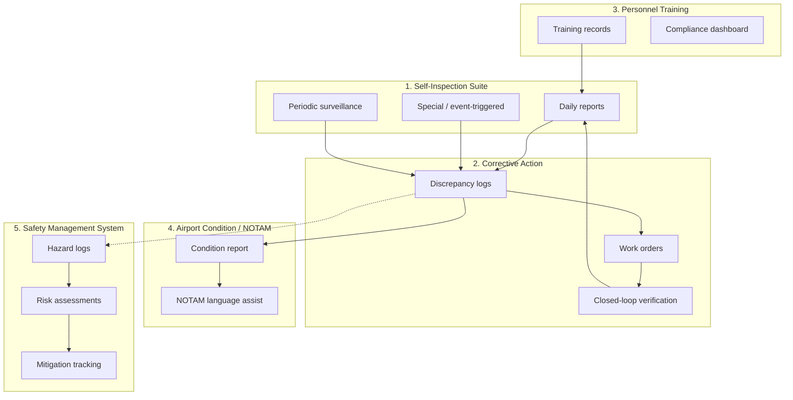

# PRD: Strvx Robotics Airport MVP

## AI-Assisted Runway Inspection & Work Order Creation

## 1. Product Summary

Strvx Robotics is building an MVP for airport operations teams to automate early-morning runway inspection workflows.

The system will use drone-captured imagery and computer vision to identify possible runway issues, organize them by runway and zone, present findings to a human inspector for review, and generate maintenance-ready tickets.

The MVP is not a fully autonomous safety-critical system. It is an AI-assisted inspection and documentation tool with a human in the loop.

## 2. Core Problem

Airport operations teams manually inspect runways before daily commercial activity begins. This process is time-consuming, labor-intensive, and requires operations staff to physically move around the airfield to identify deficiencies.

When issues are found, they must be documented, turned into work orders, sent to maintenance, repaired, and later reinspected.

Current workflow:

1. Operations agents inspect runway manually.
2. Issues are identified visually.
3. Deficiencies are logged.
4. Work orders are created for maintenance.
5. Maintenance completes repair.
6. Operations reinspects and closes the issue.

The MVP should reduce inspection time, improve documentation quality, and make issue-to-ticket creation faster.

## 3. MVP Goal

Build a dashboard that lets airport operations teams run or review drone-based runway inspections.

The drone collects images of each runway. The system analyzes those images for four issue categories, flags possible findings, and creates reviewable issue cards. A human inspector approves, rejects, or escalates each finding. Approved findings become maintenance tickets.

## Current Implementation Status

This PRD remains the product source of truth. The implementation has moved beyond the original Phase 0 mock demo into a three-service Postgres app:

* `frontend/` is a Next.js App Router UI and BFF. Most `/api/*` routes proxy to the backend; upload, live capture, reports, settings, and feedback export still run in the frontend server.
* `backend/` is a FastAPI service on port 8080 that owns most reads, writes, issues, tickets, drones, airports, and admin setup APIs.
* `ml-service/` is a FastAPI service on port 8000 for YOLO/VLM detection, live detection relay, and RL/draft improvement endpoints.
* `npm run db:setup` applies the Postgres schema only. `npm run db:bootstrap` optionally creates the AGS airport, runways, zones, and daily schedule without demo operational data.

The Phase 0 section below is historical context. The current MVP already has real persistence, upload ingestion, issue review, ticket repair/closeout, report export, feedback export, live feed UI, and backend extraction for most CRUD/read APIs.

## Current Geometry Direction

Runway map geometry is operational data, not display metadata. The current app supports manually stored runway work-area polygons and a map lifecycle status (`draft`, `active`, `retired`, `needs_review`). **These polygons are never drawn on the in-app satellite maps** — see `frontend/docs.md` § Map policy.

The next geometry layer should separate raw `Observation` records from reviewable `IssueCandidate` records. Multiple drones or images can observe the same physical defect, especially around intersecting runways. Those observations should dedupe into one candidate with traceable sources, merge/split controls, affected-runway assignments, and an unmapped-observation queue for detections that fall outside active mapped surfaces.

## 4. MVP Issue Categories

The MVP will inspect for four issue types:

### 1. Debris / FOD

Examples:

* Trash
* Loose objects
* Metal pieces
* Tools
* Plastic
* Rubber chunks
* Foreign objects on runway surface

### 2. Pavement Damage

Examples:

* Cracks
* Potholes
* Spalling
* Surface deterioration
* Loose aggregate
* Depressions
* Standing water or visible surface abnormalities

### 3. Runway Marking Issues

Examples:

* Faded markings
* Missing paint
* Obscured runway numbers
* Worn centerline markings
* Worn threshold markings
* Rubber buildup covering markings

### 4. Lighting / Signage Issues

Examples:

* Damaged runway lights
* Missing or obstructed lights
* Damaged signage
* Obstructed signage
* Misaligned or visibly broken fixtures

## 5. Non-Goals for MVP

The MVP will not include:

* Wildlife detection
* License plate reading
* Threat detection
* Voice communication
* Full autonomous maintenance ticket submission without review
* Fully automated FAA-critical decision-making
* Multi-drone coordination
* Drone swarm behavior
* GPS-denied autonomy
* Edge compute requirement
* Full Aeros Simple integration on day one

These can be considered after the first airport pilot.

## 6. Primary Users

### Admin

Responsible for setting up the airport environment.

Capabilities:

* Create airport profile
* Add runway names
* Create runway zones
* Upload or configure runway maps
* Manage users
* Configure inspection schedules

### Inspector / Operations Agent

Responsible for reviewing drone inspection results.

Capabilities:

* View scheduled inspections
* Review findings by runway
* Approve or reject issue candidates
* Add notes
* Create maintenance tickets
* Mark items for manual review

### Maintenance Team

Responsible for repairing approved issues.

Capabilities:

* View assigned tickets
* See issue location and images
* Update ticket status
* Mark repair complete
* Attach repair notes or images

## 7. Core Workflow

### Current State

Operations staff manually inspect the runway, identify issues, create tickets, maintenance repairs the issue, and operations reinspects.

### Strvx MVP Workflow

1. Inspection is scheduled for 6:00 AM.
2. Drone flies predefined route for Runway 1.
3. Drone captures images/video.
4. System uploads imagery to cloud.
5. Computer vision model scans for issue candidates.
6. System repeats process for Runway 2 and Runway 3.
7. Dashboard shows inspection summary.
8. Inspector reviews flagged issues.
9. Inspector approves, rejects, or marks issue for manual review.
10. Approved issues become maintenance tickets.
11. Maintenance repairs issue.
12. Inspector reinspects and closes ticket.

## 8. Product Screens

## 8.1 Inspection Overview Dashboard

Purpose: Give airport ops a quick view of runway status after inspection.

Fields:

* Inspection date
* Inspection time
* Airport name
* Runway list
* Status per runway
* Number of issues found
* Number of tickets open
* Number of tickets completed

Example:

Inspection: Monday, 6:00 AM

Runway 1: No issues found
Runway 2: 2 issues need review
Runway 3: No issues found

Statuses:

* Not started
* In progress
* Processing
* No issues found
* Issues need review
* Tickets created
* Completed
* Failed inspection run

## 8.2 Runway Detail Page

Purpose: Show inspection results for one runway.

Fields:

* Runway name
* Map / runway zone view
* Inspection timestamp
* Issue cards
* Image thumbnails
* Issue category
* AI confidence score
* Inspector decision
* Ticket status

Actions:

* View issue
* Approve ticket
* Reject finding
* Mark for manual review
* Add inspector note

## 8.3 Issue Detail Page

Purpose: Let inspector review one possible issue.

Fields:

* Issue ID
* Runway
* Zone / segment
* GPS coordinates if available
* Issue type
* Confidence score
* Severity
* Image evidence
* Suggested ticket text
* Inspector notes
* Status

Actions:

* Approve ticket
* Reject issue
* Request manual inspection
* Edit ticket description
* Assign to maintenance

## 8.4 Maintenance Ticket Page

Purpose: Give maintenance enough information to repair the issue.

Fields:

* Ticket ID
* Runway
* Zone
* Issue category
* Description
* Images
* Severity
* Created by
* Created at
* Assigned to
* Status
* Repair notes

Statuses:

* Draft
* Approved
* Sent to maintenance
* In progress
* Repaired
* Ready for reinspection
* Closed
* Rejected

## 9. Functional Requirements

## 9.1 Runway Setup

The system must allow an admin to:

* Create an airport
* Add runways
* Divide each runway into zones or segments
* Store inspection routes per runway
* Set inspection schedule
* Associate images/findings with a runway and zone

MVP route setup can be manual. Full automated drone route planning is not required for V1.

## 9.2 Inspection Scheduling

The system must support scheduled inspections.

MVP requirement:

* Admin can create a scheduled inspection time.
* Default example: 6:00 AM daily.
* System creates an inspection record for each runway.
* Each runway is treated as its own inspection job.

## 9.3 Image Upload / Ingestion

The system must support image ingestion from drone inspection runs.

MVP options:

* Manual image upload for V0
* Drone/cloud upload for V1
* Live drone integration for later versions

Each image should be tagged with:

* Airport
* Zone
* Boundary if known
* Timestamp
* Flight ID and inspection ID
* Drone ID when available
* Source file
* GPS metadata if available, including SRT/live GPS or still-image EXIF GPS
* Capture provenance such as altitude, heading, and source type when available

## 9.4 Computer Vision Processing

The system must process inspection images and detect possible issues in the four MVP categories.

Required categories:

* Debris / FOD
* Pavement damage
* Runway marking issues
* Lighting / signage issues

The model output should include:

* Issue category
* Confidence score
* Bounding box or segmentation mask if available
* Source image
* Runway
* Zone
* Timestamp

The model does not need to be perfect. The goal is to generate reviewable candidates, not final decisions.

## 9.5 Human Review

All detected issues must go through human review before becoming maintenance tickets.

Inspector actions:

* Approve
* Reject
* Mark for manual review
* Edit issue category
* Edit severity
* Add notes
* Create ticket

The system should never automatically create a final maintenance ticket without human approval in the MVP.

## 9.6 Ticket Creation

When an inspector approves an issue, the system creates a maintenance ticket.

Ticket must include:

* Runway
* Zone
* Issue type
* Description
* Images
* Timestamp
* Suggested severity
* Inspector notes
* Status

For MVP, tickets can live inside the Strvx dashboard.

Later, tickets should integrate with the airport’s existing work order system.

## 9.7 Reinspection and Closure

After maintenance completes a repair, the system should support reinspection.

Minimum MVP:

* Maintenance can mark ticket as repaired.
* Inspector can mark ticket as closed after review.

Future:

* Drone can automatically reinspect the same zone.
* System compares before/after images.

## 10. AI / Model Requirements

## 10.1 MVP Model Philosophy

The model should be treated as an assistant, not the final authority.

The goal is to reduce the amount of manual review, not eliminate airport operations staff from the process.

## 10.2 Model Inputs

Inputs:

* Drone images
* Optional video frames
* Runway/zone metadata
* Timestamp
* Optional GPS metadata

## 10.3 Model Outputs

Outputs:

* Issue candidate
* Issue type
* Confidence score
* Image location
* Bounding box or highlighted region
* Suggested description

## 10.4 Confidence Thresholds

Suggested MVP thresholds:

* High confidence: Show as “Likely issue”
* Medium confidence: Show as “Needs review”
* Low confidence: Hide by default but keep available in raw model output

Do not automatically create tickets based only on confidence score.

## 10.5 Model Strategy

Recommended approach:

### FOD / Debris

Use object detection or anomaly detection.

Goal:

* Find unexpected objects on runway surface.

### Pavement Damage

Use segmentation or detection.

Goal:

* Flag visible cracks, potholes, spalling, deterioration, or abnormal pavement texture.

### Runway Markings

Start with image comparison or visual degradation detection.

Goal:

* Flag faded, obscured, or damaged markings.

### Lighting / Signage

Start with asset-based inspection.

Goal:

* Given known locations of lights/signs, verify whether they appear present, visible, and undamaged.

## 11. Data Model

## Airport

Fields:

* airport_id
* name
* location
* timezone
* created_at

## Runway

Fields:

* runway_id
* airport_id
* name
* description
* length
* zones
* active_status

## Zone

Fields:

* zone_id
* runway_id
* name
* start_position
* end_position
* notes

## Inspection

Fields:

* inspection_id
* airport_id
* scheduled_time
* started_at
* completed_at
* status
* created_by

## Inspection Runway Job

Fields:

* job_id
* inspection_id
* runway_id
* status
* started_at
* completed_at
* image_count
* issue_count

## Image

Fields:

* image_id
* job_id
* runway_id
* zone_id
* file_url
* timestamp
* gps_lat
* gps_lng
* metadata

## Issue Candidate

Fields:

* issue_id
* inspection_id
* runway_id
* zone_id
* image_id
* issue_type
* confidence
* severity
* status
* model_notes
* inspector_notes
* created_at

## Ticket

Fields:

* ticket_id
* issue_id
* runway_id
* zone_id
* status
* description
* assigned_to
* created_at
* repaired_at
* closed_at
* maintenance_notes

## 12. Success Metrics

## MVP Pilot Metrics

The MVP is successful if it can show:

* Time saved per inspection
* Number of runway issues detected
* Number of false positives
* Number of approved tickets created
* Time from inspection to ticket creation
* Inspector satisfaction
* Maintenance usability
* Quality of image evidence
* Ability to review runway status quickly

## Target MVP Outcomes

Initial targets:

* Complete inspection review dashboard for 1 airport
* Support at least 3 runways
* Process uploaded drone imagery
* Detect at least 2 of the 4 issue categories reasonably well
* Allow human approval/rejection
* Generate maintenance-ready tickets
* Export inspection report

## 13. MVP Build Phases

## Phase 0: Clickable Demo / Mock Data

Goal: Show airport stakeholders the workflow.

Build:

* Inspection overview dashboard
* Runway status cards
* Issue detail page
* Ticket detail page
* Fake AI detections
* Sample images
* Manual approve/reject

No drone integration required.

## Phase 1: Image Upload MVP

Goal: Process real drone imagery after a flight.

Build:

* Upload images by runway
* Store inspection record
* Run basic model or manual issue tagging
* Display findings
* Human review
* Generate tickets

This is the fastest buildable MVP.

## Phase 2: Drone Flight Integration

Goal: Connect real drone inspection runs to the dashboard.

Build:

* Predefined runway routes
* Image capture per route
* Cloud upload
* Auto-create inspection job
* Process images after flight

## Phase 3: Work Order Integration

Goal: Connect approved tickets to airport maintenance workflow.

Build:

* Export ticket as PDF/CSV
* Email ticket to maintenance
* Later: integrate with Aeros Simple or airport work order system

## Phase 4: Automated Reinspection

Goal: Close the loop after maintenance.

Build:

* Reinspect same zone
* Compare before/after images
* Inspector closes ticket
* Track repair completion

## 14. MVP Acceptance Criteria

The MVP is ready for pilot demo when:

* Admin can create airport/runways/zones.
* System can create a 6 AM inspection record.
* Images can be uploaded and associated with a runway.
* System can display inspection status per runway.
* System can show issue candidates.
* Inspector can approve/reject findings.
* Approved findings create tickets.
* Tickets contain images, location, issue type, and notes.
* Maintenance can mark ticket as repaired.
* Inspector can close ticket.
* System can export a basic inspection report.

## 15. Demo Script

Demo flow:

1. Show airport dashboard.
2. Start with “Monday, 6:00 AM Inspection.”
3. Show Runway 1: No issues found.
4. Show Runway 2: 2 issues need review.
5. Open Runway 2.
6. Review Issue 1: possible pavement damage.
7. Show images and confidence score.
8. Approve ticket.
9. Review Issue 2: possible debris.
10. Reject or approve.
11. Show maintenance ticket generated.
12. Mark ticket repaired.
13. Close after reinspection.

## 16. Key Product Principle

The MVP should not try to prove that Strvx can fully replace airport inspectors.

The MVP should prove that Strvx can help airport operations teams inspect faster, document better, and create maintenance tickets with less manual effort.

## 17. Part 139 Compliance Platform

Daily self-inspection reports are the foundation of Part 139 compliance, but they are only one piece of the regulatory puzzle. A comprehensive Part 139 SaaS must support a **closed-loop system**: it is not enough to find hazards — the FAA requires documentation of how and when they were fixed, who found them, and what risks they pose.

This section maps the five regulatory reporting modules to current product coverage and planned work.

### 17.1 Module Architecture

### 17.2 Coverage Matrix

| Module | Regulatory basis | Retention | Shipped today | In inspection PDF | Planned |
| --- | --- | --- | --- | --- | --- |
| **1. Self-Inspection Suite** | 14 CFR §139.327 | 12 calendar months | **Built** — daily, special (event-triggered), and periodic surveillance all supported | Yes | Auto-cadence runs |
| Daily runway / taxiway / apron checks | §139.327(a) | 12 mo | **Built** — scheduled daily pass, movement-area checklist, inspector sign-off, PDF/CSV/HTML export | Checklist, attestation, runway findings | Per-airport checklist templates |
| Special inspection reports | §139.327(b) — unusual conditions | 12 mo | **Built** — `special` type with a structured trigger taxonomy (weather, aircraft incident, construction, complaint, wildlife, other) + condition notes; Launch-inspection modal on the Logs page; legacy `unusual`/`accident` retained | Type + trigger + reason on cover and inspection record | Auto-launch hooks from weather/incident feeds |
| Periodic surveillance | §139.327(c) — weekly/monthly/quarterly | 12 mo | **Built** — `periodic` type launchable ad-hoc; admin can define weekly/monthly/quarterly surveillance schedules with a description and quick-pick templates (fuel farm, friction, lighting, signage, pavement, wildlife); daily-only slot uniqueness so periodic checks can share a time | Type + description on report | Auto-generate the next periodic inspection record when a cadence comes due |
| **2. Corrective Action & Work Orders** | §139.327(d) reporting system | 12 mo (with inspection) | Partial | Yes | Expand |
| Discrepancy logs | Prompt correction of unsafe conditions | 12 mo | **Built** — AI findings → issue candidates → approve/reject with actor audit trail | Per-runway discrepancy table with severity, status, evidence | Standalone discrepancy register export |
| Work order integration | Airport maintenance system | 12 mo | **Partial** — in-app ticket lifecycle; external CMMS handoff planned | Corrective Action Log with work order ID, status, notes | Aeros Simple / email / CMMS API |
| Closed-loop verification | Discovery → resolution dates | 12 mo | **Partial** — draft → sent → in progress → repaired → reinspected → closed with `ticket_status_history` | Repair/close timestamps on corrective action rows | Automated reinspection + before/after compare |
| **3. Personnel Training Records** | Part 139 inspector qualification | 24 calendar months | **Planned** | — | P2 |
| Initial / recurrent (12 mo) training | Airfield familiarization, NOTAM, emergency plans | 24 mo | User accounts exist; no training module | — | Training record entity, compliance dashboard, expiry alerts |
| **4. Airport Condition Reporting (NOTAM)** | Part 139 + FAA NOTAM procedures | 12 mo | **Planned** | Partial mention | P2 |
| Condition report when ops affected | Threshold obscured, standing water, etc. | 12 mo | PDF flags "NOTAM review" when discrepancies open; no NOTAM log | Deficiency status references NOTAM review | Airport Condition Report generator + RCAM snow/ice language assist |
| **5. Safety Management System (SMS)** | Part 139 SMS (certain airports, 2023+) | 36 calendar months | **Planned** | — | P3 |
| Hazard and risk logs | Systemic hazards, risk assessments, mitigations | 36 mo | Not modeled | — | SMS hazard register, risk matrix, mitigation status reports |

### 17.3 Current Inspection Report Contents (PDF)

Each exported inspection report (`/api/inspections/[id]/report?format=pdf`) currently includes:

1. **Cover** — Part 139 self-inspection record title, inspection type (daily / unusual / accident), schedule, sign-off, checklist/runway/ticket metrics.
2. **Inspection record** — Airfield condition status, checklist pass/fail/N/A counts, inspector attestation, trigger reason for special inspections.
3. **Movement-area checklist** — Standard §139-style items (pavement, FOD, markings, lighting, drainage, safety areas, obstructions).
4. **Runway discrepancy sections** — AI-detected findings with evidence, location, confidence, severity, disposition, linked work order.
5. **Corrective action log** — Work orders from this inspection with status, maintenance notes, repair and close dates.
6. **Reference assets** — Airport/FAA diagram links where configured.
7. **Footer** — 12-month retention reminder per §139.327.

JSON and CSV exports carry the same underlying `InspectionReport` payload for spreadsheet and archive systems.

### 17.4 Retention & Archive Requirements

| Record type | Minimum retention | Current behavior | Target |
| --- | --- | --- | --- |
| Self-inspection reports | 12 consecutive calendar months | Postgres persistence + export; no automated purge | Retention policy flag + archive export job |
| Training records | 24 consecutive calendar months | Not implemented | Training module with expiry enforcement |
| SMS records | 36 consecutive calendar months | Not implemented | SMS module with extended retention tier |

### 17.5 Build Phases (Part 139)

| Phase | Focus | Key deliverables |
| --- | --- | --- |
| **P1 (current)** | Self-inspection + closed-loop foundation | Daily/special inspection PDF, checklist, sign-off, discrepancy → work order → close |
| **P2** | Periodic inspections + NOTAM + training | Periodic schedules, Airport Condition Report, training compliance dashboard (24 mo) |
| **P3** | SMS + external integrations | Hazard/risk/mitigation logs (36 mo), CMMS handoff, automated reinspection |

### 17.6 Acceptance Criteria (Part 139 Pilot)

A Part 139 pilot airport can demonstrate:

1. Daily self-inspection documented with checklist, findings, sign-off, and export retained ≥12 months.
2. Special inspection launched after an event with reason captured on the report.
3. Every approved discrepancy linked to a work order with discovery → repair → close timestamps.
4. Inspector identity recorded on sign-off and status history (audit trail).
5. *(P2)* Training compliance visible per inspector; NOTAM suggested when condition affects operations.
6. *(P3)* SMS hazard register with 36-month retention for qualifying airports.

### 17.7 Continuation Notes — Resume Here Next Session

**Done so far (Module 1 — Self-Inspection Suite: complete)**

- **Special inspections** — `special` inspection type + trigger taxonomy (weather, aircraft_incident, construction, complaint, wildlife, other) on `inspections.trigger`. Launch via the "Launch inspection" modal on `/logs` (`components/LaunchInspectionModal.tsx`). Trigger shown on the PDF cover + record, logs table, and inspection detail. Legacy `unusual`/`accident` retained.
- **Periodic surveillance** — `inspection_schedules` gained `frequency` (daily/weekly/monthly/quarterly), `inspection_type` (daily/periodic), and `label`. Admin **Schedule** section split into "Daily passes" vs "Periodic surveillance" with cadence badges + quick-pick templates (`lib/surveillanceTemplates.ts`). Daily-only partial unique index so periodic checks can share a time slot.

**Next up (pick one):**

1. **Module 3 — Personnel Training Records (recommended; self-contained, 24-mo retention).**
   - New `training_records` table: `id, user_id, airport_id, kind` (initial/recurrent), `topic` (airfield familiarization, NOTAM, emergency plan, etc.), `completed_at`, `expires_at` (completed_at + 12 mo), `note`, `created_by`, `created_at`.
   - Backend: `repo/training.py` (CRUD + `expiring_soon`), routes in `routers/writes.py` + a read in `routers/reads.py`.
   - Frontend: new admin **Training** section (or a tab under Users) — per-user training table, add-record form, an expiry/compliance dashboard (overdue = red, due ≤60d = amber). Surface "training current" on the Users table.
   - Retention: keep ≥24 months; no auto-purge yet (flag only).
2. **Module 2 — Closed-loop discrepancy register** — standalone export of discovery→repair→close across inspections (reuses `ticket_status_history`).
3. **Module 4 — Airport Condition Report + NOTAM assist** — generate suggested NOTAM language from open discrepancies (RCAM for snow/ice).
4. **Module 5 — SMS** — hazard/risk/mitigation logs (36-mo retention).
5. **Module 1 polish** — auto-generate the next periodic inspection record when a cadence comes due (needs a scheduler/cron; none exists yet — schedules are config only).

**End-to-end pattern to follow (used for both features above):**
`backend/app/constants.py` (enums) → `models.py` → `repo/*.py` → `routers/writes.py`+`reads.py` → schema in **`frontend/lib/db.ts`** (CREATE + `ADDITIVE_MIGRATIONS`) and `backend/tests/schema.sql` → frontend `lib/types.ts`, `lib/repo.ts`, `lib/ui.ts`, `lib/api.ts` → UI → `lib/reportPdf.ts` if it belongs on the report → `npx tsc --noEmit` → `npm run db:setup` (applies migration).

**Gotchas / reminders:**
- After any schema change, run `npm run db:setup` from `frontend/` (idempotent; requires approval — it writes to the live DB).
- `frontend/app/admin/page.tsx` is large and often open in the editor; `tsc` can show transient errors mid-edit. Re-run before acting.
- Backend dedup/uniqueness is intentionally daily-only (`idx_schedules_daily_slot` partial index); keep periodic rows exempt.
- Verification artifacts may linger in the dev DB (a sample special inspection + two periodic schedules) — harmless, deletable from the UI.
- Models extend the camelCase `_Camel` base, so new snake_case columns serialize automatically; remember to add the field to the `to_*` mapper and the matching `*Row` interface in `frontend/lib/repo.ts`.
